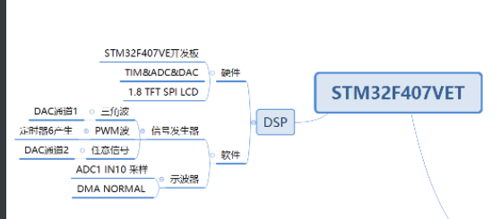

基于STM32F407VET开发板的DSP测量设计

# 目的

​	制作温度检测、信号发生、波形测量、频谱测量

# 项目器材

## 硬件器材

STM32F407VET开发板、DAPlink仿真器、1.8LCD屏

## 小组成员

 芦梦玥 刘良浩

# 开发环境

**软件环境:**

- Windows 10
- STM32CubeMX
- keilV5

# 程序开发

## 设计思路

​	

## 程序逻辑

## 模块设计

### 后端

#### 1.8TFT文件

提供LCD驱动和简单的绘图函数

#### ADC

1. adc_function 对外部信号的采样，分别包含频谱压制用的窗函数，采样函数
2. 采样部分分别有NTC温度、MCU温度、IN10的码值。

#### DAC

由于DAC输出使用DMA方式，所以要做的很简单，生成相应的波形数组就好，所以里面包含了四种基本波的数组。

#### Delay

#### FFT

FFT则是进行傅里叶变换所使用。

### 前端

#### 思路

#### signal_generation 信号发生器

#### osc示波器

#### temperature 温度测量

# 个人感悟

2. 

# 鸣谢

2. 
